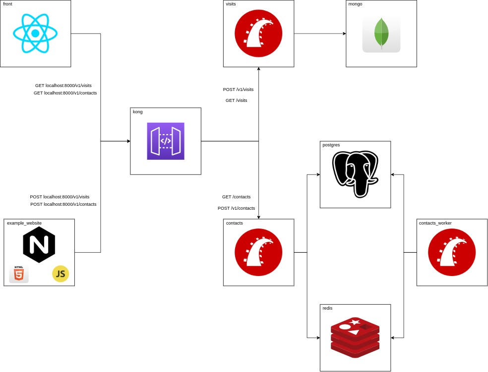

# Instructions

_Be sure to have docker and docker-compose installed._

```bash
  $ docker-compose build
  $ docker-compose run contacts rails db:create db:migrate
  $ docker-compose up -d
```

_NOTE: If you are having permission problems when using Linux, try to run the following commands before proceeding:_

```bash
  $ docker-compose down
  $ sudo chown -R $USER:$USER mongodata
  $ sudo chown -R $USER:$USER postgresdata
```
### Architecture

